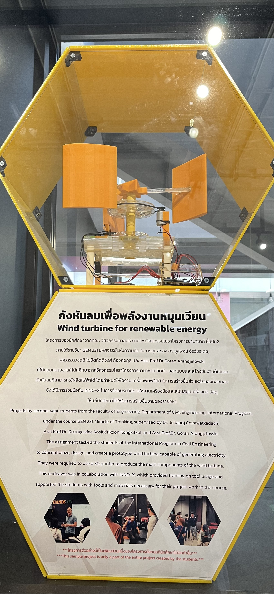
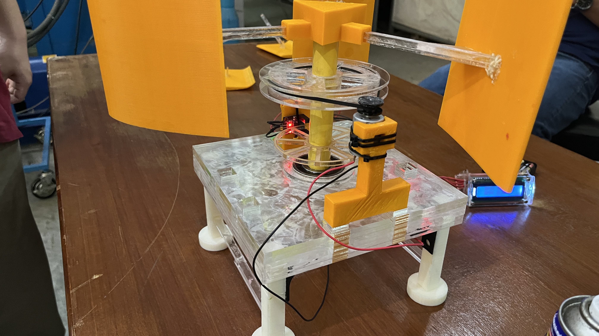

# Skills

* **Engineering & Design Software**: AutoCAD, Revit, Civil 3D
* **Structural Analysis**: SAP2000, Abaqus, VisualFEA (CBT), SUTStructor
* **Project Management**: Microsoft Project
* **Computational Tools**: MATLAB
* **Documentation**: Microsoft Excel, Microsoft Word

# Work Experience

## Site Engineer Intern at **CES**
**June 2025 - Aug 2025 (2 months)**
 Supported on-site construction for industrial projects, ensuring design compliance and efficient workflow.

**Accomplishments**
* Performed slope and elevation analysis for **32,600–35,000 sq.m.** areas, collecting **700+ elevation points**.
* Calculated accurate quantity take-offs for concrete, rebar, and formwork.
* Verified concrete volumes for slabs, ramps, and trenches against design specs.
* Inspected reinforcement installations and coordinated corrective actions onsite.

# Projects

## Structural Health Monitoring of Wat Arun
**Wat Arun Ratchavararam**

Non-invasive heritage structure assessment using 3D laser scanning and finite element analysis.

 

**Key Features**
* **3D Scanning**: Processed post-earthquake 3D laser scan data.
* **Geometry Analysis**: Compared pre-event and post-event geometry.
* **Material Testing**: Created masonry prism specimens.
* **Simulation**: Built a finite element model for structural analysis.
* **Evaluation**: Evaluated settlement and self-weight effects.

## Reinforced Concrete Design Project
**2-Storey Reinforced Concrete Home Office**

Structural design using the Strength Design Method.

 

**Key Features**
* **Element Design**: Designed slabs, beams, columns, stairs, and foundations.
* **Software Utilization**: Used SAP2000, Excel, and Structural Analyzer.
* **Load Analysis**: Calculated loads and internal forces.
* **Documentation**: Prepared full structural drawings and report.

  

    <iframe src="https://www.youtube.com/embed/flXTO_AkzQQ" style="position: absolute; top: 0; left: 0; width: 100%; height: 100%; border:0;" allow="accelerometer; autoplay; clipboard-write; encrypted-media; gyroscope; picture-in-picture" allowfullscreen></iframe>
  

## Vertical Axis Wind Turbine Design
**Presented at KMUTT Open House (2024)**

Designed, analyzed, and optimized a Vertical Axis Wind Turbine (VAWT) with the core objective of generating sufficient power to illuminate a connected light bulb.

 

**Key Accomplishments & Features**
* **Development & Coding**: Developed custom Arduino code to accurately measure RPM and process real-time performance data.
* **Testing & Optimization**: Conducted comprehensive wind velocity tests to refine aerodynamic efficiency and maximize energy output.
* **Recognition**: Selected by professors as one of the **"Best of 3rd-Year Projects"**.

  

    
    

    

    

  

<em>Click on an image to view full size</em>

© 2026 Siwakorn Siwaworawet. Powered by Jekyll and the Minimal Theme.

